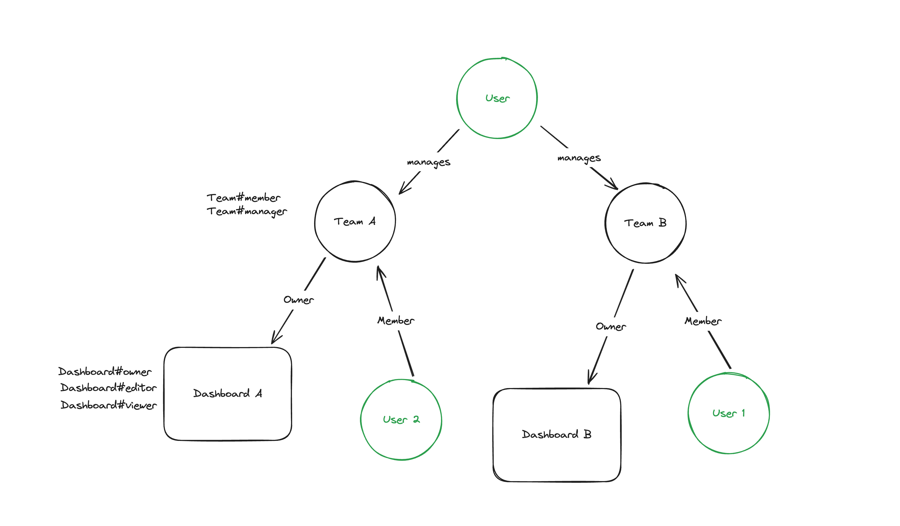

# Permit.io LoTR RBAC+ABAC and ReBAC example
## About
This Spring Boot API demonstrates the use of Permit.io permission checks via the Permit.io SDK using RBAC+ABAC and ReBAC policy models. All of the policy data is inside of Permit.io and user, action, resource are passed current passed as query string params (see  [src/main/java/com/permit/check/example/ExampleApplication.java](src/main/java/com/permit/check/example/ExampleApplication.java ))

## Dependencies

1. Spring Boot 3.3.1
1. Java 22 (built with `java version "22.0.1" 2024-04-16`)
1. Permit.io PDP running on :7766

## Setup
1. Copy the `permit_key` from the Permit.io dashboard
1. Replace the value in [src/main/java/com/permit/check/example/ExampleApplication.java:31](src/main/java/com/permit/check/example/ExampleApplication.java:31 )
1. Replace the value in the PDP call below.

## Steps to run
1. Start the Permit.io PDP:
    
     `docker run -it -p 7766:7000 --env PDP_DEBUG=True --env PDP_API_KEY=permit_key_abc permitio/pdp-v2:latest`
1. Start this app:

    `./mvnw spring-boot:run`
1. Make API calls to test the permissions


## Example API calls
### RBAC+ABAC
The following are values that can be tested with:
1. Frodo/High Potential: 

    `{"sub":"frodo@middle-earth.com","name":"Frodo Baggins","subscription":"High Potential"}`
1. Gimli/Sustain: 

    `{"sub":"gimli@middle-earth.com","name":"Gimli","subscription":"Sustain"}`
1. Gandalf/Core: 

    `{"sub":"gandalf@middle-earth.com","name":"Gandalf the Grey","subscription":"Core"}`
1. Aragorn/Flagship: 

    `{"sub":"aragorn@middle-earth.com","name":"Aragorn","subscription":"Flagship"}`

#### Example curl calls with response
```
curl --location 'http://localhost:8080/API/1?user=gandalf%40middle-earth.com&segment=US'
``` 
`gandalf@middle-earth.com` IS PERMITTED to GET API 1!<br /><br />

```
curl --location 'http://localhost:8080/API/2?user=gandalf%40middle-earth.com&segment=US'
```
`gandalf@middle-earth.com` IS PERMITTED to GET API 2!<br /><br />
```
curl --location 'http://localhost:8080/API/3?user=gandalf%40middle-earth.com&segment=US'
```
`gandalf@middle-earth.com` IS PERMITTED to GET API 3!<br /><br />
```
curl --location 'http://localhost:8080/API/4?user=gandalf%40middle-earth.com&segment=US'
```
`gandalf@middle-earth.com` is NOT PERMITTED to GET API 4!<br /><br />


### ReBAC
Example of the ReBAC structure


#### Example curl calls with response
```
curl --location 'http://localhost:8080/dashboard/OneRing?user=gandalf%40middle-earth.com&action=update'
```
`gandalf@middle-earth.com` IS PERMITTED to update Dashboard OneRing!<br /><br />

```
curl --location 'http://localhost:8080/dashboard/TheEyeOfSauron?user=gandalf%40middle-earth.com&action=update'
```
`gandalf@middle-earth.com` is NOT PERMITTED to update Dashboard TheEyeOfSauron!<br /><br />

```
curl --location 'http://localhost:8080/dashboard/TheEyeOfSauron?user=sauron%40middle-earth.com&action=update'
```
`sauron@middle-earth.com` IS PERMITTED to update Dashboard TheEyeOfSauron!<br /><br />

```
curl --location 'http://localhost:8080/dashboard/OneRing?user=sauron%40middle-earth.com&action=update'
```
`sauron@middle-earth.com` is NOT PERMITTED to update Dashboard OneRing!<br /><br />

### Todo
1. Make API calls to Permit.io to setup the env
1. Make API calls to setup permissions
1. Make API calls Populate ReBAC data